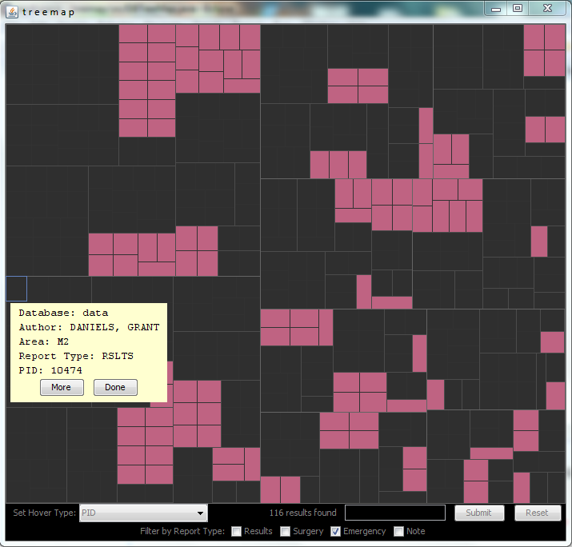

# Treemap Demo
This is a demo of a treemap (a visualization of hierarchical data) written in Java.

This was a very old intern project that was a POC for trying to visualize a lot of data. I occasionally get asked about it, so I've decided to upload to github as a backup and perhaps one day I can make improvements to it.

# Prerequisites
You'll need the following software and libraries to run this program:
* [Java 6, update 6](http://www.oracle.com/technetwork/java/javase/downloads/java-archive-downloads-javase6-419409.html) - This was built on this version
* [Prefuse beta-2007.10.21](http://prefuse.org/) - Use the sourceforge link, not the latest from their github repo
* [Apache Lucene Core 2.3.2](https://lucene.apache.org/core/)
* [dom4j 1.6.1](https://dom4j.github.io/)
* [MySQL](https://www.mysql.com/) - Optional, but highly recommended

# Setup
## Database
This relies on MySQL database. If a MySQL database is not available, you will need to create one or modify the files in `src/util/` to work with your database. The database table must contain the index field `pid` and fields listed in `src/PatientDocument.java`.

## XML file creation
Run the file `src/util/DBtoXML.java` to create a XML file from a MySQL database. It will generate a file in the `data` folder with the filename `dbtable.xml`, where `dbtable` is the database table. Modify `DBtoXML.java` to point to your database.

## Apache Lucene Index
Run the file `src/util/LuceneIndexBuilder.java` to create an Apache Lucene index from a MySQL database. It will generate the folder `data/LuceneIndex`. Again, modify `LuceneIndexBuilder.java` to point to your database.

# Running the program
Run the file `src/DBTreeMap.java` to generate a treemap. Modify the `TREE_CHI` variable to point to the xml file you created earlier.

Some notes:
* When hovering over a section, the `More` button only works if you set the hover type (aka "depth of the tree") to `PID`.
* The search field requires Lucene search syntax (e.g. `sex:M`). For more information, see the [docs](https://lucene.apache.org/core/2_9_4/queryparsersyntax.html).

# Example
An example is provided in the `example` folder. Copy the `data` folder and place it in the `src` folder.
